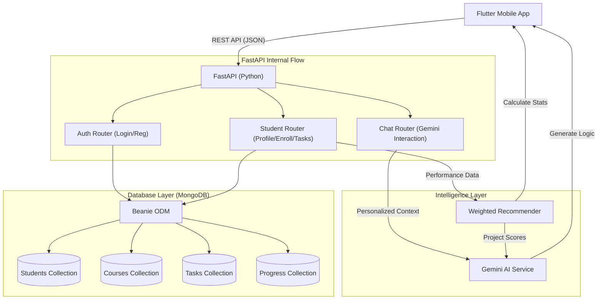

# AI Study Chatbot - Backend Architecture Documentation

This document provides a comprehensive overview of how the Python backend functions, its core components, and the data flow between services.

## System Architecture Diagram

---

## Component Breakdown

### 1. FastAPI Routers
*   **Auth Router**: Handles user authentication. It verifies coordinates from the `Students` collection and returns a session ID.
*   **Student Router**: The core engine of the app. It handles:
    *   **Onboarding**: Triggers the enrollment process and **automatically generates tasks** based on course topics.
    *   **Progress Tracking**: Updates the `Progress` collection whenever a task is submitted.
    *   **High-Value reasoning**: Exposes endpoints for AI-driven study plans and progress summaries.
*   **Chat Router**: Manages the interaction between the student and Gemini. It fetches the student's profile *before* every message to ensure context-aware responses.

### 2. Intelligent Services
*   **AI Service (Gemini)**: 
    *   Uses `gemini-1.5-flash` for high-speed, reliable reasoning.
    *   **Adaptive Study Planner**: Generates markdown schedules that automatically skip topics already marked as "completed" in the database.
    *   **Analytical Summarizer**: Correlates accuracy and completion data to provide native-language progress reviews.
*   **ML Service (Heuristic Recommender)**:
    *   Calculates a **Weighted Score** for FYP projects.
    *   **Logic**: `(Skill Match * 0.4) + (Interest Match * 0.5) + (Trending Bonus * 0.1)`.
    *   Identifies exactly which technical skills are represented by the student's top-performing courses.

### 3. Data Persistence (MongoDB + Beanie)
*   We use **Beanie ODM**, which allows us to treat MongoDB collections as Python classes.
*   **Automatic Linking**: When a student completes a task, the system uses the `course_id` to find the corresponding `Progress` record and increment the counters.

---

## Detailed Backend Workflow: The "High-Value reasoning" Cycle

This is how the backend processes a request for an "AI Study Plan":

1.  **Request Trigger**: The Flutter client calls `GET /students/{id}/study-plan`.
2.  **Profile Retrieval**: The Student Router fetches the `Student` object (Interests, Semester, Pace).
3.  **Progress Context**: The router queries the `Progress` collection to see which courses are active.
4.  **Completed Filters**: The router queries the `Task` collection for all titles where `status == "completed"`.
5.  **Gemini Handover**: The code sends all three (Profile + Courses + Completed Topics) to the `AIService`.
6.  **Instruction Set**: Gemini is instructed to:
    *   *"Ignore the topics in the 'Completed Topics' list."*
    *   *"Focus extra time on 'Weak Subjects' from the profile."*
    *   *"Format the output in Markdown."*
7.  **Adaptive Response**: Gemini returns a unique plan that evolves as the student marks tasks as done.
8.  **Delivery**: The Python backend returns the final markdown string to the app.

## Database Workflow (Task Completion)

1.  **Submission**: Client sends `POST /tasks/submit` with `student_id` and `task_id`.
2.  **Mark Done**: Backend finds the `Task` document and updates `status = "completed"`.
3.  **Metric Calculation**:
    *   Find the `Progress` record for that specific course.
    *   Increment `tasks_completed`.
    *   Calculate new `accuracy`: `total_completed / total_tasks`.
4.  **UI Refresh**: The next time the Dashboard is opened, the **AI Progress Insights** will instantly detect these changes and the summary will say: *"Great job on finishing [Topic]! You've improved your accuracy to [X]%"*.
