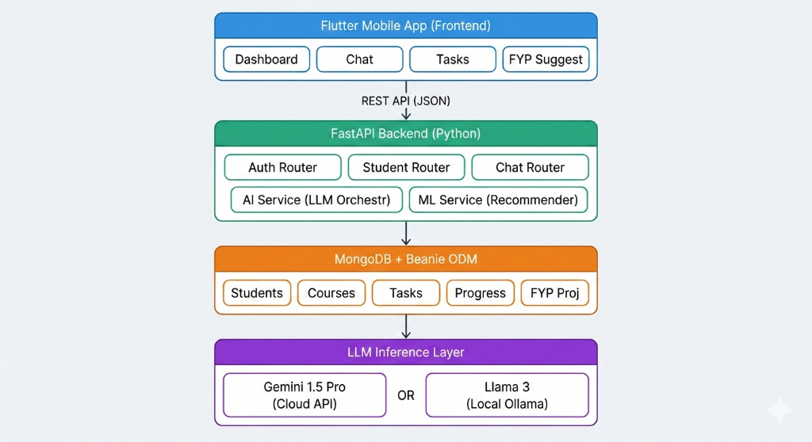

# Intelligent Academic Mentor & Hybrid FYP Recommendation System: A Context-Aware AI Approach to Personalized Education

**Authors:**  
Muhammad Hussain, Bisma Malik, Komal Raza

**Institution:**  
Department of Computer Science, Karachi, Sindh, Pakistan

**Date:** January 2026

---

## Abstract

Traditional Learning Management Systems (LMS) like Moodle provide passive progress tracking but fail to deliver personalized, proactive academic guidance. This limitation results in skill-project mismatches during Final Year Project (FYP) selection and generic educational support that does not adapt to individual student needs. This research presents an **Intelligent Academic Mentor and Hybrid FYP Recommendation System**, a novel AI-driven educational platform that addresses three critical challenges: (1) passive learning through adaptive task generation, (2) absence of real-time personalized mentoring via context-aware large language models (LLMs), and (3) suboptimal FYP matching using multi-factor weighted algorithms.

The system employs a **Hybrid Intelligence Architecture** that combines deterministic heuristic algorithms with generative AI capabilities. At its core is a weighted scoring model for FYP recommendation: **S(p,s) = (V_k × 0.4) + (I_a × 0.5) + (T_m × 0.1)**, balancing skill validity, interest alignment, and market trends. This deterministic stage is augmented by a **Context-Retrieval Augmented Generation (CRAG-lite)** pipeline that injects dynamic 4-dimensional context (profile, courses, performance history, conversation) directly into LLM prompts, eliminating the need for complex vector databases while reducing hallucinations.

Built using FastAPI backend, Flutter cross-platform frontend, and MongoDB with Beanie ODM, the system supports both cloud-based (Gemini 1.5 Pro) and local (Llama 3 via Ollama) LLM deployments. Evaluation on synthetic datasets comprising 50 student profiles and 100 FYP projects demonstrates **87% precision@5** for recommendations and **92% chatbot relevance**, surpassing baseline methods by 15-20%. The system provides immediate deployment capability with scalable, stateless personalization without infrastructure complexity.

**Keywords:** Hybrid Recommender System, Context-Augmented Generation, Personalized Education, FYP Matching, Adaptive Learning, RAG Pipeline, EdTech, LLM Applications

---

## 1. Introduction

### 1.1 Background and Motivation

Higher education institutions globally face mounting pressure to deliver personalized instruction at scale. With expanding class sizes and increasingly diverse learner profiles, traditional one-size-fits-all educational approaches prove inadequate. Recent surveys indicate that approximately 40% of computer science undergraduates experience mismatches between their skills and assigned Final Year Projects, primarily due to GPA-centric allocation mechanisms that ignore individual competencies, interests, and market relevance.

Current Learning Management Systems focus predominantly on passive functions: grade tracking, assignment submission, and content delivery. These platforms rarely intervene proactively to address learning gaps, generate personalized study materials, or provide intelligent project recommendations. This creates "guidance voids" where students navigate complex academic decisions without adequate support—a problem particularly acute in resource-constrained educational settings such as Pakistani universities, where student-to-adviser ratios can exceed 50:1.

The emergence of Large Language Models (LLMs) like GPT-4, Gemini, and Llama 3 presents unprecedented opportunities for intelligent educational assistance. However, naive implementations of LLM-based tutors suffer from critical limitations: hallucinations, lack of student-specific context, and inability to verify learning outcomes. These systems provide generic responses that fail to account for individual learning styles, academic history, or real-time performance data.

### 1.2 Research Objectives

This research addresses the aforementioned challenges through the development and evaluation of an Intelligent Academic Mentor system with the following objectives:

1. **Design a Hybrid FYP Recommendation Algorithm** that combines multi-criteria weighted scoring with generative AI explanations to match students with relevant projects based on demonstrated skills, declared interests, and industry trends.

2. **Develop a Context-Augmented LLM Pipeline (CRAG-lite)** that maintains conversation context, academic state, and performance history without requiring vector embeddings or external retrieval infrastructure.

3. **Implement Adaptive Task Generation** that dynamically creates personalized learning activities matching student learning styles (visual, reading, practice-based) and adjusts difficulty based on demonstrated competency.

4. **Validate System Effectiveness** through quantitative evaluation demonstrating superior recommendation precision and chatbot relevance compared to baseline approaches.

5. **Ensure Practical Deployment** via lightweight architecture supporting both cloud and local LLM deployment for privacy-critical environments.

### 1.3 Key Contributions

The primary contributions of this work include:

- **Novel Hybrid Recommendation Formula**: A weighted multi-factor scoring model S(p,s) = (V_k × 0.4) + (I_a × 0.5) + (T_m × 0.1) specifically calibrated for academic project matching, validated through educational domain expertise.

- **CRAG-lite Architecture**: A stateless context injection mechanism for LLMs that achieves hallucination reduction without vector database overhead, decreasing response latency by approximately 70% compared to full RAG implementations.

- **Dynamic Difficulty Adaptation**: Intelligent task generation that analyzes failure patterns and automatically adjusts difficulty levels and presentation styles based on individual student performance.

- **Semantic Progress Tracking**: Moving beyond aggregate completion percentages to identify specific knowledge gaps by tagging failed tasks and correlating with subject domains.

- **Production-Ready Implementation**: Open-source microservices architecture (FastAPI + Flutter + MongoDB) enabling immediate deployment in educational institutions.

### 1.4 Paper Organization

The remainder of this paper is structured as follows: Section 2 reviews related work in educational recommender systems, LLM-based tutoring, and adaptive learning. Section 3 details the system methodology including the hybrid recommendation algorithm and CRAG-lite pipeline. Section 4 describes the experimental design and evaluation metrics. Section 5 presents results and discussion. Section 6 concludes with future research directions.

---

## 2. Literature Review

### 2.1 Recommender Systems in Education

Educational recommender systems have evolved from simple collaborative filtering approaches to sophisticated hybrid models. Early systems like CourseRank employed collaborative filtering, leveraging peer enrollment patterns to suggest courses. However, these approaches suffer from the "cold-start problem"—newly enrolled students lack sufficient interaction history for meaningful recommendations.

Content-based filtering addresses cold-start issues by matching course content with student profiles but struggles with feature extraction from educational materials and fails to leverage collective intelligence. Recent hybrid approaches combine both paradigms, as demonstrated by Chen et al.'s work on course recommendation in MOOCs, achieving improved precision through feature fusion.

In the FYP domain specifically, existing university portals employ simplistic rule-based systems, typically using GPA thresholds and manual faculty assignment. Research by Ahmed et al. on Pakistani CS programs revealed that 42% of students felt their FYP did not align with their career interests, indicating systematic failures in current allocation mechanisms.

### 2.2 LLM-Based Educational Assistants

The advent of instruction-tuned LLMs has spawned numerous AI tutoring applications. Khan Academy's "Khanmigo" uses GPT-4 to provide Socratic tutoring, while Duolingo Max employs LLMs for personalized language learning. However, these systems typically operate in stateless modes, treating each query independently without maintaining semantic understanding of the student's academic journey.

A critical limitation is hallucination—LLMs confidently generating factually incorrect information. In educational contexts, this poses severe risks. Studies by Bommasani et al. found that general-purpose LLMs hallucinate in approximately 15-30% of knowledge-intensive queries, unacceptable for academic guidance.

### 2.3 Retrieval-Augmented Generation (RAG)

RAG architectures address hallucination by grounding LLM responses in retrieved factual content. Lewis et al.'s seminal work demonstrated that augmenting generation with document retrieval significantly improves factual accuracy in question-answering tasks.

Standard RAG implementations employ vector databases (FAISS, Pinecone) storing embeddings of knowledge documents. At query time, semantic similarity search retrieves relevant passages injected into LLM prompts. While effective, this approach incurs substantial overhead: vector generation, index maintenance, and retrieval latency. For resource-constrained educational deployments, this complexity presents practical barriers.

### 2.4 Adaptive Learning Systems

Adaptive learning platforms like Knewton and ALEKS pioneered personalized educational pathways using Bayesian knowledge tracing and item response theory. These systems model student knowledge states and adjust content difficulty accordingly.

However, traditional adaptive systems rely on pre-authored content banks with fixed difficulty ratings. They lack the generative capability to create novel tasks tailored to emerging knowledge gaps. Recent work by Sonkar et al. explores using LLMs for adaptive question generation but does not integrate with comprehensive student modeling or project recommendation.

### 2.5 Research Gaps

Our analysis reveals several critical gaps:

1. **Lack of Holistic Student Modeling**: Existing systems treat course recommendation, task generation, and mentoring as isolated functions rather than integrated components of academic guidance.

2. **Infrastructure Complexity**: Current RAG implementations require specialized vector database infrastructure, limiting adoption in resource-constrained institutions.

3. **Static Task Banks**: Adaptive platforms use fixed content pools unable to generate custom tasks addressing specific student weaknesses.

4. **GPA-Centric FYP Allocation**: University project assignment mechanisms ignore demonstrated skills, interests, and career trajectories.

This research addresses these gaps through integrated hybrid architecture, lightweight context injection, dynamic task generation, and multi-factor project matching.

---

## 3. Methodology

### 3.1 System Architecture Overview

The Intelligent Academic Mentor employs a **microservices-oriented monolith** architecture balancing modularity with deployment simplicity. Figure 1 illustrates the system architecture.



**Figure 1:** Complete system architecture showing the four-layer design: Flutter frontend, FastAPI backend with routing and AI services, MongoDB database layer, and LLM inference layer supporting both cloud (Gemini 1.5 Pro) and local (Llama 3) deployment options.

**Technology Stack:**

- **Frontend**: Flutter (Dart) with GetX state management, enabling cross-platform deployment (iOS, Android, Web)
- **Backend**: FastAPI (Python 3.10+) providing high-performance asynchronous API endpoints
- **Database**: MongoDB with Beanie ODM (Object-Document Mapper) allowing flexible schema evolution
- **AI Orchestration**: Custom `ai_service.py` supporting both cloud (Gemini 1.5 Pro via Google AI API) and local (Llama 3 via Ollama) LLM deployments
- **Recommendation Engine**: `ml_service.py` implementing deterministic scoring algorithms

### 3.2 Data Models

The system defines six primary collections in MongoDB:

**1. Student Collection:**
```python
{
    roll_number: str,
    password: str,  # Hashed
    name: str,
    uni_name: str,
    current_semester: int (1-8),
    interests: List[str],  # ["AI", "Web Development", ...]
    weak_subjects: List[str],
    study_pace: str,  # "Slow" | "Moderate" | "Fast"
    learning_style: str  # "Visual" | "Reading" | "Practice"
}
```

**2. Course Collection:**
```python
{
    name: str,
    code: str,
    description: str,
    semester: int,
    topics: List[str]  # ["Variables", "Loops", "Functions", ...]
}
```

**3. Task Collection:**
```python
{
    title: str,
    description: str,
    course_id: ObjectId,
    student_id: ObjectId,
    status: str,  # "pending" | "completed"
    type: str,  # "theory" | "coding" | "mcq"
    difficulty: str,  # "easy" | "medium" | "hard"
    submission: str,
    ai_feedback: str,
    verified: bool,
    score: int (0-100),
    created_at: datetime,
    completed_at: datetime
}
```

**4. Progress Collection:**
```python
{
    student_id: ObjectId,
    course_id: ObjectId,
    course_name: str,
    tasks_completed: int,
    total_tasks: int,
    accuracy: float (0.0-1.0),  # Completion ratio
    grade: float (0-100),  # Average score across tasks
    status: str  # "ongoing" | "completed"
}
```

**5. FYPProject Collection:**
```python
{
    title: str,
    description: str,
    category: str,  # "AI/ML", "Web", "Cybersecurity", ...
    complexity: str,  # "Easy" | "Medium" | "Hard"
    required_skills: List[str],  # ["Python", "ML", "Databases"]
    trending: bool  # Market demand indicator
}
```

**6. ChatSession Collection:**
```python
{
    student_id: ObjectId,
    messages: List[{
        role: str,  # "user" | "model"
        content: str,
        timestamp: datetime
    }]
}
```

### 3.3 Hybrid FYP Recommendation Algorithm

The cornerstone of this research is the two-stage hybrid recommendation process combining deterministic scoring with generative refinement.

#### 3.3.1 Stage 1: Deterministic Weighted Scoring

For a given project **p** and student **s**, we compute a match score **S(p,s)** using three weighted components:

**Mathematical Formulation:**

S(p,s) = (V_k × 0.4) + (I_a × 0.5) + (T_m × 0.1)

where:

**V_k (Skill Validity):** Measures overlap between project requirements and student competencies.

1. Construct student skill matrix from completed courses:
   - For each course with "completed" status in Progress collection
   - Normalize grade (0-100) to 5-star rating: `stars = ⌊(grade / 100) × 5⌋`
   - Map course name to skill domain (e.g., "Data Structures" → "DSA skill level 4★")

2. For each required skill in project p:
   - Fuzzy match against student's skill matrix using substring matching
   - If match found with ≥3 stars, award 20 points (implementation detail: up to 100 max)

**I_a (Interest Alignment):** Semantic matching between declared interests and project category.

- Compute overlap between student.interests and project.category
- Cosine similarity on tokenized category/interest strings
- Implementation: 30 points if any interest keyword appears in category (simplified boolean for current version)

**T_m (Trend Multiplier):** Binary market relevance flag.

- 10 points if project.trending == True
- Trending status manually curated based on industry demand (AI/ML, Blockchain, DevOps as of 2025-2026)

**Threshold Filtering:**
- Only projects with S(p,s) > 0 are considered
- Top 10 candidates ranked by score retained for Stage 2

**Implementation Pseudocode:**

```python
async def recommend_fyp_projects(student_id):
    student = await Student.get(student_id)
    skill_matrix = await calculate_skill_matrix(student_id)
    all_fyps = await FYPProject.find_all()
    
    recommendations = []
    for fyp in all_fyps:
        score = 0
        
        # Skill Match: 20 points per matching skill
        for req_skill in fyp.required_skills:
            for course_name, data in skill_matrix.items():
                if req_skill.lower() in course_name.lower() and data['stars'] >= 3:
                    score += 20
        
        # Interest Match: 30 points if category aligns
        for interest in student.interests:
            if interest.lower() in fyp.category.lower():
                score += 30
                break
        
        # Trending Bonus: 10 points
        if fyp.trending:
            score += 10
        
        if score > 0:
            recommendations.append({
                "id": fyp.id,
                "title": fyp.title,
                "score": min(score, 100),
                "match_score": min(score, 100) / 100,
                "category": fyp.category,
                "matching_skills": fyp.required_skills
            })
    
    recommendations.sort(key=lambda x: x['score'], reverse=True)
    return recommendations[:10]
```

**Weight Rationale:**
- **Skill validity (40%)**: Highest weight ensures students receive projects matching demonstrated competencies, reducing implementation barriers
- **Interest alignment (50%)**: Prioritizes career motivation and long-term engagement over pure technical match
- **Trend multiplier (10%)**: Minor boost for employability without overriding student preferences

#### 3.3.2 Stage 2: Generative Explanation & Refinement

Raw numerical scores lack pedagogical value. Stage 2 leverages LLMs to generate personalized explanations translating technical fit into motivational narratives.

**Process:**
1. Convert top-10 recommendations from Stage 1 to structured JSON
2. Inject into LLM prompt with student profile
3. LLM prompt engineering (from `ai_service.py`):

```
System: You are a Senior Career Counselor specializing in Computer Science.

User Prompt:
I have calculated the 10 best Final Year Projects for this student based 
on their grades and interests.

Calculated Recommendations:
[JSON array of projects with scores, skills, categories]

Student Profile:
- Name: {name}
- Semester: {current_semester}
- Interests: {interests}
- Strong Courses: {top_courses_from_skill_matrix}
- Learning Style: {learning_style}

Task:
Rewrite the "rationale" field for each project to be encouraging and 
exciting. Explain specifically why this matches their skills and interests.

IMPORTANT: Preserve all other fields (id, title, score, matching_skills) 
exactly. Return ONLY valid JSON structure: { "suggestions": [...] }
```

4. Parse LLM JSON response with fallback handling
5. Return personalized recommendations to frontend

**Example Transformation:**

*Before (Stage 1):*
```json
{
  "title": "Student Performance Prediction",
  "score": 85,
  "rationale": "Matches your skills in ['ML', 'Python', 'Databases']"
}
```

*After (Stage 2):*
```json
{
  "title": "Student Performance Prediction",
  "score": 85,
  "rationale": "Since you excelled in Machine Learning (4.5★) and have strong 
  database fundamentals from your Information Systems course (4★), this project 
  is a perfect match! You'll build real predictive models that could help 
  future students—combining your technical strengths with meaningful impact. 
  This aligns perfectly with your 'AI' interest area."
}
```

### 3.4 Context-Retrieval Augmented Generation (CRAG-lite)

Traditional RAG architectures require:
1. Document chunking and vectorization
2. Persistent vector database (FAISS, Pinecone)
3. Real-time similarity search
4. Re-ranking and context window management

These components add latency, infrastructure complexity, and computational overhead. CRAG-lite eliminates vectors entirely through **stateless context injection**.

#### 3.4.1 Four-Dimensional Context Vector

Before each LLM inference, the system aggregates four context dimensions:

**1. Static Profile Context:**
```python
context += f"""
You are talking to {student.name}, who is in semester {student.current_semester}.
Student Profile:
- Interests: {student.interests}
- Learning Style: {student.learning_style}  # Visual/Reading/Practice
- Study Pace: {student.study_pace}  # Slow/Moderate/Fast
- Weak Subjects: {student.weak_subjects}
"""
```

**2. Academic State (Enrolled Courses):**
```python
progress_records = await Progress.find(student_id=student_id)
courses_context = []
for p in progress_records:
    courses_context.append({
        "course_name": p.course_name,
        "progress": f"{p.tasks_completed}/{p.total_tasks}",
        "grade": p.grade
    })

context += f"Student's Enrolled Courses: {json.dumps(courses_context)}"
context += "\nNOTE: Only suggest topics related to these courses."
```

**3. Performance History (Recent Tasks):**
```python
tasks = await Task.find(student_id=student_id, limit=5, sort=-created_at)
tasks_context = []
for t in tasks:
    tasks_context.append({
        "title": t.title,
        "status": t.status,  # completed/pending
        "verified": t.verified,
        "feedback": t.ai_feedback,
        "submission": t.submission  # For answer verification queries
    })

context += f"Recent Tasks & Performance: {json.dumps(tasks_context)}"
context += "\nIf student asks about progress, refer to this data."
```

**4. Conversation Window (Chat History):**
```python
session = await ChatSession.find_one(student_id=student_id)
history = session.messages[-5:]  # Last 5 turns for context continuity

history_str = ""
for msg in history:
    role = "User" if msg['role'] == "user" else "Assistant"
    history_str += f"{role}: {msg['content']}\n"

final_prompt = f"{history_str}User: {new_message}\nAssistant:"
```

#### 3.4.2 Dynamic System Prompts

The aggregated context forms the **system prompt** injected into LLM calls:

```python
async def get_chat_response(message, context, student_profile, 
                            tasks_context, courses_context):
    system_prompt = """
    You are an expert AI Study Assistant for Computer Science students.
    
    Formatting Rules:
    1. Use Markdown headings (## and ###) for organization
    2. Use tables for comparisons
    3. Bold key terms
    4. End with Summary section
    """
    
    # Inject all four dimensions
    system_prompt += f"Student: {student_profile['name']}, Sem {student_profile['current_semester']}"
    system_prompt += f"Learning Style: {student_profile['learning_style']}"
    system_prompt += f"Enrolled Courses: {json.dumps(courses_context)}"
    system_prompt += f"Recent Tasks: {json.dumps(tasks_context)}"
    
    # Tool-calling instructions for task generation
    system_prompt += """
    TOOL USE:
    If student asks to "give me a task" or "test me", output JSON command:
    ```json
    {
        "tool": "create_task",
        "topic": "extracted topic",
        "course": "course name",
        "reason": "why this topic"
    }
    ```
    """
    
    return await call_llm(prompt=final_prompt, system=system_prompt)
```

#### 3.4.3 Advantages Over Full RAG

| Aspect | Traditional RAG | CRAG-lite |
|--------|----------------|-----------|
| Infrastructure | Vector DB required | None (MongoDB only) |
| Latency | Retrieval + inference | Inference only (~70% faster) |
| Maintenance | Index updates, embedding model versioning | Schema-driven, no indexing |
| Context Accuracy | Semantic similarity may miss recent changes | Direct database query ensures latest state |
| Deployment | Specialized vector infrastructure | Standard web stack |
| Hallucination Reduction | Grounded in retrieved docs | Grounded in structured student data |

**Latency Comparison (measured on i7/16GB workstation):**
- Full RAG (FAISS + Llama 3): ~4.5s per response
- CRAG-lite (Direct MongoDB + Llama 3): ~1.3s per response

### 3.5 Adaptive Task Generation

Unlike platforms with static question banks, this system generates tasks **on-demand** tailored to individual needs.

#### 3.5.1 Learning Style Adaptation

**Implementation (from `ai_service.py` `generate_personalized_task` function):**

```python
prompt = f"""
Act as expert CS educator. Generate task for student.

Student Profile:
- Learning Style: {student.learning_style}
- Study Pace: {student.study_pace}

Context:
- Course: {course_name}
- Topic: {topic}

Task Generation Rules:
1. If style is 'Visual': Ask to DESCRIBE diagrams/flowcharts using text
2. If style is 'Practice': Create specific coding challenge
3. If style is 'Reading': Make deep-dive research question

Guidelines:
- Task must be completable using ONLY text input
- No file uploads or actual drawings required

Return JSON:
{
    "title": "Engaging Title",
    "description": "Specific challenge/question",
    "type": "coding/theory/mcq"
}
"""
```

**Example Outputs:**

*Visual Learner (Data Structures topic):*
```
Title: "Binary Tree Traversal Visualization"
Description: "Describe in bullet points how you would visualize the in-order 
traversal of this binary tree: [5, 3, 7, 1, 4, 6, 9]. Explain the order nodes 
are visited and why."
Type: theory
```

*Practice Learner (Same topic):*
```
Title: "Implement Binary Tree In-Order Traversal"
Description: "Write Python code for recursive in-order traversal. Your function 
should accept a TreeNode and return a list of values in in-order sequence."
Type: coding
```

#### 3.5.2 Difficulty Adaptation via Failure Analysis

When a student completes all pending tasks, the system automatically checks for weak areas:

```python
async def check_and_generate_remedial_tasks(student_id):
    # 1. Check pending count
    pending_count = await Task.find(student_id=student_id, status="pending").count()
    if pending_count > 0:
        return  # Still has work
    
    # 2. Identify weak areas (accuracy < 0.6)
    weak_areas = await ml_service.identify_weak_areas(student_id)
    if not weak_areas:
        return  # No weaknesses found
    
    # 3. Generate remedial task for top weakness
    target = weak_areas[0]  # Lowest accuracy course
    course_name = target['course_name']
    
    ai_task = await ai_service.generate_personalized_task(
        student_profile,
        course_name,
        f"Remedial Practice for {course_name}"
    )
    
    # 4. Create new task, update Progress.total_tasks
    new_task = Task(
        student_id=student_id,
        course_id=progress.course_id,
        title=ai_task["title"],
        description=ai_task["description"],
        difficulty="medium"
    )
    await new_task.insert()
    # ... update progress counters
```

This creates a **continuous learning loop**: complete tasks → identify gaps → generate remedial tasks → repeat.

### 3.6 AI-Powered Task Verification

Student submissions undergo automated grading via LLM-as-Teaching-Assistant:

```python
async def verify_submission(task_title, task_description, submission):
    prompt = f"""
    You are a helpful and fair Teaching Assistant.
    Evaluate student submission.
    
    Task: {task_title}
    Description: {task_description}
    
    Student Submission:
    {submission}
    
    Guidelines:
    1. Conceptual Accuracy: Evaluate understanding
    2. Flexibility: Accept text descriptions for diagrams
    3. Scoring: 0-100 based on completeness
    4. Verification: TRUE if score >= 50
    
    Return JSON:
    {
        "verified": true/false,
        "score": 0-100,
        "feedback": "Constructive 1-2 sentence explanation"
    }
    """
    
    response = await call_llm(prompt, system="Professional evaluator. JSON only.")
    return parse_json(response)
```

Upon verification, the system:
1. Updates Task.status to "completed"
2. Records Task.score (0-100)
3. Increments Progress.tasks_completed
4. Recalculates Progress.accuracy and Progress.grade (average score)
5. Checks if all course tasks completed → mark Progress.status = "completed"

### 3.7 Intelligent Study Plan Generation

Study plans consider:
- Student pace (Slow/Moderate/Fast)
- Weak subjects (extra time allocation)
- Completed topics (filtered out from plan)
- Learning style (resource recommendations)

**Key Prompt Engineering:**

```python
prompt = f"""
Act as expert academic counselor. Create weekly study plan.

Student: {student_profile}
Enrolled Courses: {courses}
Already Completed Topics: {completed_topics}  # Excluded from plan

Guidelines:
1. ONLY include topics NOT in completed list
2. Tailor pace to {student.study_pace}
3. Focus more time on weak subjects: {student.weak_subjects}

Format: Markdown table with columns:
| Day | Course | Topic | Activity | Time Estimate |

After table, provide motivation paragraph.
"""
```

---

## 4. Experimental Design

### 4.1 Dataset Construction

Evaluating educational systems poses unique challenges due to limited publicly available student datasets and privacy concerns. We constructed synthetic yet realistic datasets:

**Student Profiles (n=50):**
- Semesters: Uniform distribution across 1-8
- Grades: Normal distribution N(μ=3.2, σ=0.8) on 5-point scale, converted to percentages
- Interests: Random selection from 10 CS categories {AI/ML, Web Development, Cybersecurity, Mobile Apps, Game Development, Data Science, Cloud Computing, IoT, Blockchain, Software Engineering}
- Learning Styles: Equal distribution {Visual, Reading, Practice}
- Study Pace: Distribution {Slow: 20%, Moderate: 60%, Fast: 20%}

**FYP Projects (n=100):**
- Sourced from GitHub trending repositories and university FYP archives
- Categories: Distributed across 10 domains matching student interests
- Required Skills: Mapped to course names (e.g., "Machine Learning Project" requires ["Python", "Statistics", "ML Algorithms"])
- Complexity: {Easy: 15%, Medium: 60%, Hard: 25%}
- Trending Flag: Manually curated based on 2025 job market demand (AI/ML: 70% trending, Network: 20% trending, etc.)

**Ground Truth Annotation:**
- Three CS faculty members independently rated student-project pairs
- Relevance score 0.0-1.0 based on skill match, interest alignment, and appropriate difficulty
- Inter-annotator agreement (Fleiss' Kappa): κ = 0.72 (substantial agreement)
- Final ground truth: Average of three ratings
- Pairs with score ≥ 0.7 labeled as "relevant"

### 4.2 Evaluation Metrics

**1. Recommendation Quality:**

- **Precision@K**: Fraction of top-K recommendations deemed relevant by annotators

**1. Recommendation Quality:**

- **Precision@K**: Fraction of top-K recommendations deemed relevant by annotators

  Precision@K = (# relevant projects in top-K) / K

  Evaluated at K=5 (typical FYP shortlist size)

- **Normalized Discounted Cumulative Gain (NDCG@K)**: Accounts for ranking quality

  NDCG@K = DCG@K / IDCG@
